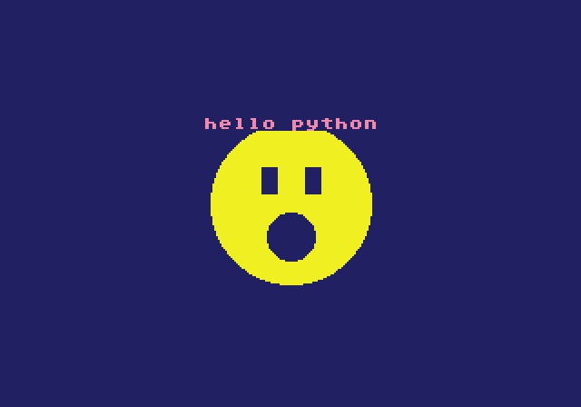
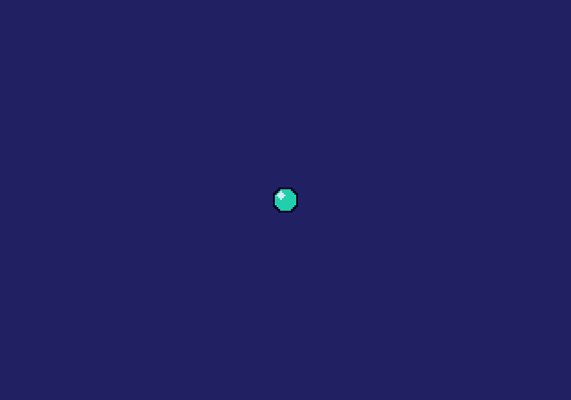

# mdpython

Write **Sega Genesis / Mega Drive** games in a pygame-flavored **Python** that
compiles to native 68000 (via SGDK). Part of the pycretro console-Python family
(with **gbapython** for GBA and **gtpython** for the GameTank).

**Native resolution: 320 × 224** (H40). Shape drawing (`circfill`/`rectfill`/
`line`) uses a **256 × 160 canvas anchored at the top-left**; hardware sprites,
`print` text, and `blit` use the full 320 × 224. Colors are PICO-8-style indices
0–15. Numbers are 16.16 fixed point. Familiar, not compatible — see
`DIFFERENCES.md`.

## Your first game

```python
import pygame

pygame.init()
screen = pygame.display.set_mode((320, 224))   # MUST be 320x224 (native)
clock = pygame.time.Clock()

running = True
while running:
    cls(1)                              # dark blue background

    print("hello python", 116, 32, 14)  # title text, pink, near the top

    # a smiley face, drawn entirely with shapes
    circfill(128, 80, 44, 10)           # head: a big yellow circle
    rectfill(112, 60, 120, 74, 0)       # left eye: a black square
    rectfill(136, 60, 144, 74, 0)       # right eye
    circfill(128, 98, 13, 0)            # mouth: a black circle

    clock.tick(60)
```

```sh
mdpython build examples/hello/main.py -o hello.bin
mdpython run   examples/hello/main.py      # opens a Genesis Plus GX window
```

That exact code produces this — `mdpython run` shows:


*The hello example: shapes + text, drawn by the code above (examples/hello).*


`npm install` brings the m68k-gcc + SGDK WASM toolchain and the Genesis Plus GX
core. The compiler front-end is the `pycretro` package.

## Sprites


*pygame.image.load + blit -> a hardware sprite (examples/sprite)*

## What you can do

- **Draw** (within the 256×160 canvas): `cls`, `screen.fill((r,g,b))`,
  `rectfill/rect/circfill/circ/line/pset`, `print(text, x, y, color)`.
- **Sprites** (full 320×224): `pygame.image.load` + `screen.blit`; 80 hardware
  sprites, 20 per scanline.
- **Input:** `pygame.key.get_pressed()` + `pygame.K_*` (d-pad, K_z=A, K_x=B,
  K_c=C, K_RETURN=Start).
- **Rects, classes, sprite.Group, mixer, font** — same API as the family
  (`docs/CHEATSHEET.md`).
- **Audio:** `pygame.mixer.music.play(-1)` (built-in demo tune, or load a
  `.vgm`).

## Examples

`examples/`: hello, sprite, music. Build with `mdpython build examples/<name>/main.py`.

See `docs/CHEATSHEET.md`, `docs/ASSETS.md` (image/music formats), and
`DIFFERENCES.md`.

---
*Screenshots are the raw framebuffer at 2× integer scale (pixel-perfect
native). Note: Genesis pixels display at the hardware's native aspect on real
hardware; these images preserve exact pixels rather than resampling to a TV
aspect.*
